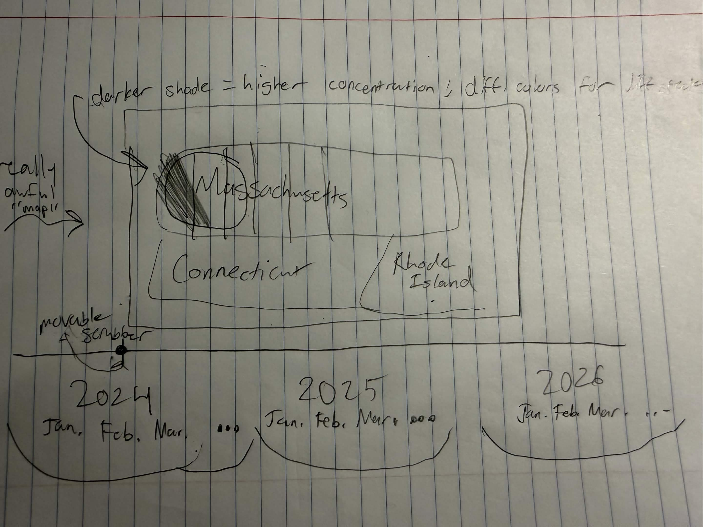
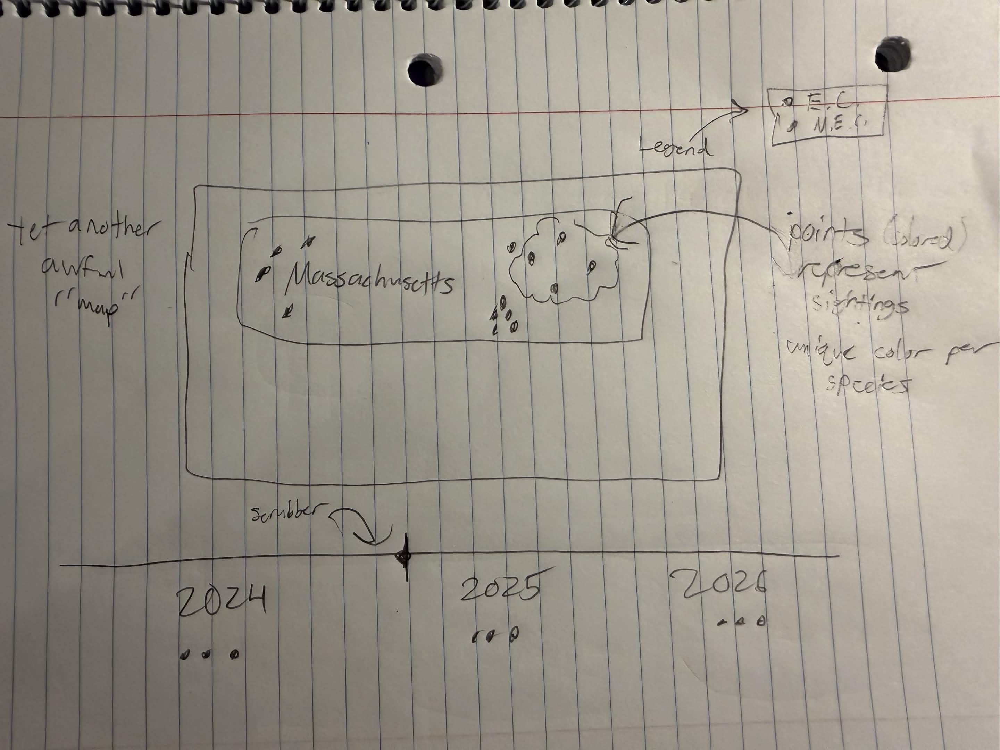

# Final Project - Initial Ideas

## Topic
I am interested in exploring the population distributions and activity patterns of cottontail rabbits in the New England region. A while ago, I learned about the vulnerable "New England cottontail" (_Sylvilagus transitionalis_), and efforts to restore its population by creating new habitats. I'm hoping to learn more about where they've actually been observed in the years since those efforts have started.

## Potential Questions
- How dramatic is the difference between the Eastern cottontail population and the New England cottontail population?
- How have the populations changed over time?
- Are there visible signs of the New England cottontail population recovering?
- When and where are cottontails most frequently seen?

## Datasets

I'm not entirely sure what datasets I would use for this, but iNaturalist (and, by extension, GBIF) provide a great wealth of high-quality data on wildlife observations. For example, with some filtering, it's fairly easy to find [all **living** cottontails observed by iNaturalist users in New England](https://www.inaturalist.org/observations?quality_grade=research&identifications=most_agree&captive=false&place_id=52339&taxon_id=43096&verifiable=true&spam=false&term_id=17&term_value_id=18). This is not a huge dataset, but it's big enough to be interesting, and I could probably find more.

## Related projects

iNaturalist as a whole is research-oriented and provides great visualization tools for people who are interested in wildlife. More specific to cottontails, though, the University of New Hampshire operates a project called [NH Rabbit Reports](https://www.nhrabbitreports.org/), which solicits reports of rabbit and hare sightings from New Hampshire residents.

## Sketches

### Sketch 1

The rough idea here is to have a heatmap of observations of the different species, all throughout New England and across a period of multiple years. Obviously I would use a real embedded map and not some hand-drawn garbage :-)

The progression through time would be implemented with a timeline scrubber, pretty much like a video. I haven't yet figured out how I'd want to represent change over larger periods of time.

### Sketch 2

This is more inspired by the NH Rabbit Reports project. It's a similar concept to the one in Sketch 1, except instead of aggregating observations into a heat map, I would display them as individual points (or clusters) on the map.

### Unsketched

Some things I've been thinking about but haven't figured out how to represent yet:
- Relating observations with weather (getting historical data might be complicated)
- Making the maps more interactive ("click a point to see a bunny" ?)
- Clearly differentiating species (different colors? icons?)